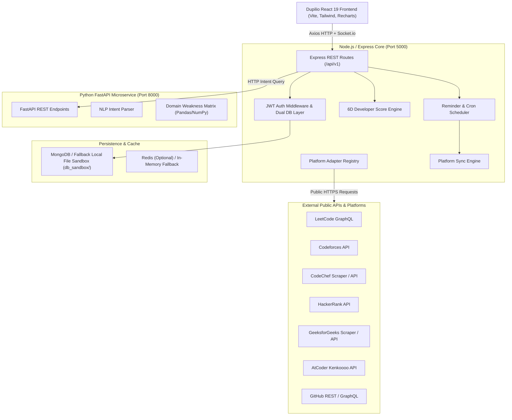

# DUPILIO System Architecture

## 1. High-Level Architecture Overview

DUPILIO is engineered as an enterprise-grade full-stack platform designed for unified developer scoring, competitive programming contest tracking, hackathon discovery, automated AI preparation, and student community collaboration.

---

## 2. Core Architectural Principles

### A. Zero-Credential Platform Verification
DUPILIO does not request or store third-party passwords. Integrations connect purely via public developer handles (e.g. `tourist`, `neal_wu`). The adapter architecture sanitizes and caches stats securely.

### B. Transparent 6-Dimensional Developer Score
Rather than an arbitrary metric, Dupilio calculates an explainable score between 0 and 100:
1. **Competitive Programming (25%)**: Normalized rating scale across Codeforces, LeetCode, and CodeChef.
2. **DSA & Problem Solving (20%)**: Volume and difficulty weights (Easy = 1pt, Med = 3pt, Hard = 6pt).
3. **Open Source & Projects (15%)**: GitHub stars, original repositories, and contribution history.
4. **Hackathons & Challenges (15%)**: Verified hackathons, hiring challenges, and open-source fellowship milestones.
5. **Consistency & Streaks (15%)**: Active daily problem-solving streaks and contest participation cadence.
6. **Core CS & Fundamentals (10%)**: Knowledge domain mastery across OS, DBMS, Networks, and System Design.

### C. Deterministic Node.js Action Validation
While the Python AI microservice or LLM extracts natural language intents, **all state mutations are strictly validated and created inside Node.js**. No LLM output directly mutates the database.

### D. Dual-Mode Database Abstraction (`backend/src/config/db.js`)
If MongoDB is offline or unavailable during local evaluation, the database layer automatically routes queries to a local JSON file-based sandbox (`backend/db_sandbox/`). All operations support `find`, `findOne`, `create`, `findOneAndUpdate`, `updateMany`, `deleteMany`, `countDocuments`, `insertMany`, and sorting.

### E. Pluggable Voice Provider (`VoiceProvider.js`)
Voice reminders and AI announcements interface through a clean provider contract:
- `VoiceProvider.js`: Base abstract class defining `synthesize(text, options)`.
- `MockVoiceProvider.js`: Production-safe fallback with sound file generation or Web Speech API integration.
- `ElevenLabsProvider.js` / `GoogleTtsProvider.js`: Pluggable drop-ins via environment configuration.
